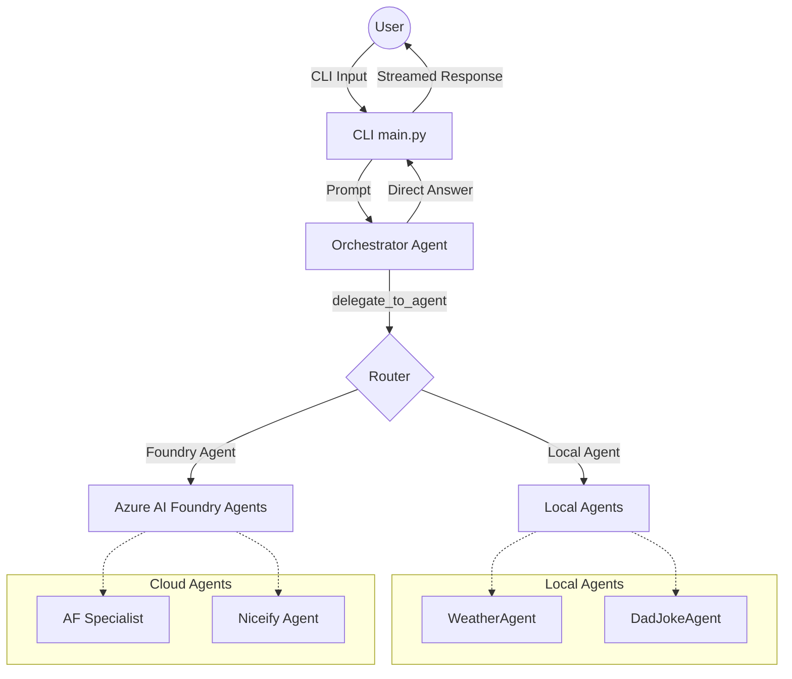

# Foundry Agent Orchestrator

This project implements a multi-agent orchestrator using the `agent_framework` and Azure AI Foundry. It provides a command-line interface (CLI) to interact with a central orchestrator agent that intelligently routes user requests to various specialist agents, which can be either running locally or hosted in the cloud (Azure AI Foundry).

## Architecture

The system is built around a central **Orchestrator Agent** that acts as a router. When a user submits a prompt, the orchestrator analyzes the request and decides whether to answer it directly or delegate it to one of the specialized agents.



### Components

1.  **Orchestrator (`orchestrator.py`)**:
    *   Uses the `agent_framework` to create an `OrchestratorDirectAgent`.
    *   Equipped with a `delegate_to_agent` tool that allows it to route queries to specific specialist agents by name.
    *   Dynamically loads local agents from `agents.yaml`.
    *   Supports multiple LLM providers (Azure AI Foundry, Azure OpenAI, OpenAI) configured via environment variables.

2.  **Specialist Agents**:
    *   **Local Agents** (Defined in `agents.yaml`):
        *   `WeatherAgent`: A local agent equipped with a `get_weather` tool (defined in `local_agent.py`) to answer weather-related questions.
        *   `DadJokeAgent`: A local agent that generates dad jokes directly based on its system instructions.
    *   **Cloud-Hosted Foundry Agents** (Invoked via `foundry_tools.py`):
        *   `AF`: An Air Force aircraft specialist agent hosted on Azure AI Foundry.
        *   `Niceify`: An agent hosted on Azure AI Foundry that transforms negative or sad content into a positive reframing.

3.  **Foundry Tools (`foundry_tools.py`)**:
    *   Provides async wrappers to invoke existing Azure AI Foundry agents using the `azure-ai-agents` SDK.
    *   Handles authentication, agent ID resolution (with caching), thread creation, and message retrieval.

4.  **CLI (`main.py`)**:
    *   Provides an interactive REPL for users to chat with the orchestrator.
    *   Supports streaming responses.
    *   Includes slash commands for direct agent invocation and session management:
        *   `/af <question>`: Force call the AF specialist agent.
        *   `/niceify <text>`: Force call the Niceify agent.
        *   `/history`: Print conversation history.
        *   `/clear`: Clear conversation history.
        *   `/help`: Show help text.
        *   `/quit` or `/exit`: Exit the CLI.

## Configuration

The system relies on environment variables for configuration. Create a `.env` file in the root directory with the following variables:

```env
# Model Provider (foundry, azure_openai, openai)
MODEL_PROVIDER=foundry

# Azure AI Foundry Configuration
FOUNDRY_PROJECT_ENDPOINT=<your_project_endpoint>
FOUNDRY_MODEL_DEPLOYMENT_NAME=<your_model_deployment_name>
# Optional: Set to "true" to use API key auth instead of DefaultAzureCredential
FOUNDRY_USE_KEY_AUTH=false
FOUNDRY_API_KEY=<your_api_key>

# Foundry Agent Names (if different from defaults)
AF_AGENT_NAME=AF
NICEIFY_AGENT_NAME=Niceify

# Azure OpenAI Configuration (if MODEL_PROVIDER=azure_openai)
AZURE_OPENAI_ENDPOINT=<your_azure_openai_endpoint>
AZURE_OPENAI_DEPLOYMENT_NAME=<your_deployment_name>
AZURE_OPENAI_API_KEY=<your_api_key>

# OpenAI Configuration (if MODEL_PROVIDER=openai)
OPENAI_MODEL=<your_openai_model>
OPENAI_API_KEY=<your_api_key>
```

## Usage

1.  Ensure you have the required dependencies installed (see `requirements.txt` or `pyproject.toml`).
2.  Set up your `.env` file with the necessary credentials and endpoints.
3.  Run the CLI:

```bash
python main.py
```

To enable debug logging, run:

```bash
python main.py --debug
```

## Adding New Agents

### Adding a Local Agent
1.  Define the agent's instructions and tools in `agents.yaml`.
2.  Implement any necessary tools in a Python module (e.g., `local_agent.py`).
3.  Update the `OrchestratorDirectAgent` instructions in `agents.yaml` to make it aware of the new agent.

### Adding a Foundry Agent
1.  Ensure the agent is deployed in your Azure AI Foundry project.
2.  Update the `OrchestratorDirectAgent` instructions in `agents.yaml` to make it aware of the new agent.
3.  The `delegate_to_agent` tool in `orchestrator.py` will automatically attempt to resolve and call the Foundry agent by its display name if it's not found locally.

## Recent Updates
*   **Streaming Responses**: The orchestrator now streams responses back to the CLI in real-time, significantly reducing perceived latency and improving the user experience.
*   **Dynamic Agent Loading**: Local agents are now dynamically loaded from `agents.yaml`, making it easier to add and configure new agents without modifying the core orchestrator code.
*   **Unified Routing**: The `delegate_to_agent` tool now handles routing to both local and cloud-hosted Foundry agents seamlessly.
