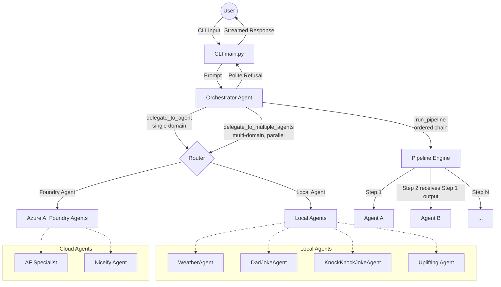

# Foundry Agent Orchestrator

This project implements a multi-agent orchestrator using the `agent_framework` and Azure AI Foundry. It provides a command-line interface (CLI) to interact with a central orchestrator agent that intelligently routes user requests to various specialist agents, which can be either running locally or hosted in the cloud (Azure AI Foundry).

## Architecture

The system is built around a central **Orchestrator Agent** that acts as a router. When a user submits a prompt, the orchestrator analyzes the request and decides whether to answer it directly or delegate it to one of the specialized agents.

### Key Innovation: Pure-Text / No-Code Agents
A major architectural innovation of this project is the **Pure-Text Agent Configuration**. 
* **The Orchestrator is Pure Text:** The complex routing logic, intent classification, and behavioral constraints are not written in Python `if/else` statements. They are defined entirely in natural language within `agents.yaml`.
* **Pure-Text Specialist Agents:** You can create entirely new, fully functional agents (like the `DadJokeAgent` or `KnockKnockJokeAgent`) without writing a single line of code. If an agent's job is purely generative or conversational, it can exist entirely as a YAML configuration block. This allows non-developers to rapidly prototype and deploy new agents.



### Components

1.  **Orchestrator (`agent/orchestrator.py`)**:
    *   Uses the `agent_framework` to create an `OrchestratorDirectAgent`.
    *   Equipped with **three routing tools**:
        *   `delegate_to_agent(agent_name, query)` — routes a single-domain request to one specialist.
        *   `delegate_to_multiple_agents(agent_queries)` — fans out to multiple specialists **concurrently** via `asyncio.gather`. The tool accepts a list of `{agent_name, query}` objects, runs them all in parallel, and returns labeled results for the orchestrator to synthesise. If one agent fails, the others still succeed (`return_exceptions=True`).
        *   `run_pipeline(pipeline_name, initial_input)` — executes a named, ordered agent chain defined in `agents.yaml`. The output of each step feeds automatically as the input to the next; steps abort early on error with a clear diagnostic.
    *   All three tools share a common `_invoke_agent` coroutine for local-vs-Foundry dispatch, keeping the logic in one place.
    *   **Strict Routing Policy**: The orchestrator is explicitly instructed *not* to answer questions using its own general knowledge. If a request cannot be handled by one of its known specialist agents or pipelines, it will politely decline to assist.
    *   Dynamically loads local agents, Foundry agents, and pipelines from `agents.yaml`. Both the agent list and the pipeline list are injected into the orchestrator's prompt automatically via `{{AGENT_LIST}}` — no manual prompt editing required.
    *   Supports multiple LLM providers (Azure AI Foundry, Azure OpenAI, OpenAI) configured via environment variables.

1a. **Pipeline Engine (`agent/pipeline.py`)**:
    *   Provides the data model (`PipelineStep`, `Pipeline`) and YAML loader (`load_pipelines`) for declarative agent chains.
    *   Intentionally decoupled from execution: `agent/pipeline.py` only describes *what* a pipeline is; `agent/orchestrator.py` handles *running* it.
    *   `Pipeline.step_summary` renders a human-readable chain (e.g. `DadJokeAgent → Uplifting`) that is automatically included in the orchestrator's injected prompt.

2.  **Specialist Agents**:
    *   **Local Agents** (Defined in `agents.yaml`):
        *   `WeatherAgent`: A local agent equipped with a `get_weather` tool (defined in `agent/local_agent.py`) to answer weather-related questions.
        *   `DadJokeAgent`: A local agent that generates dad jokes directly based on its system instructions.
        *   `KnockKnockJokeAgent`: A local agent that generates knock-knock jokes directly based on its system instructions.
        *   `Uplifting`: A local agent that rewrites any text in a warm, encouraging, positive tone. Used as the second step in both pipelines. No tools or cloud credentials required.
    *   **Cloud-Hosted Foundry Agents** (Invoked via `agent/foundry_tools.py`):
        *   `AF`: An Air Force aircraft specialist agent hosted on Azure AI Foundry.
        *   `Niceify`: An agent hosted on Azure AI Foundry that transforms negative or sad content into a positive reframing.

3.  **Foundry Tools (`agent/foundry_tools.py`)**:
    *   Provides async wrappers to invoke existing Azure AI Foundry agents using the `azure-ai-agents` SDK.
    *   Handles authentication, agent ID resolution (with caching), thread creation, and message retrieval.

4.  **CLI (`main.py`)**:
    *   Provides an interactive REPL for users to chat with the orchestrator.
    *   Supports streaming responses.
    *   Includes slash commands for direct agent invocation and session management:
        *   `/af <question>`: Force call the AF specialist agent.
        *   `/niceify <text>`: Force call the Niceify agent.
        *   `/history`: Print conversation history.
        *   `/clear`: Clear conversation history.
        *   `/help`: Show help text.
        *   `/quit` or `/exit`: Exit the CLI.

## Configuration

The system relies on environment variables for configuration. Create a `.env` file in the root directory with the following variables:

```env
# Model Provider (foundry, azure_openai, openai)
MODEL_PROVIDER=foundry

# Azure AI Foundry Configuration
FOUNDRY_PROJECT_ENDPOINT=<your_project_endpoint>
FOUNDRY_MODEL_DEPLOYMENT_NAME=<your_model_deployment_name>
# Optional: Set to "true" to use API key auth instead of DefaultAzureCredential
FOUNDRY_USE_KEY_AUTH=false
FOUNDRY_API_KEY=<your_api_key>

# Foundry Agent Names (if different from defaults)
AF_AGENT_NAME=AF
NICEIFY_AGENT_NAME=Niceify

# Azure OpenAI Configuration (if MODEL_PROVIDER=azure_openai)
AZURE_OPENAI_ENDPOINT=<your_azure_openai_endpoint>
AZURE_OPENAI_DEPLOYMENT_NAME=<your_deployment_name>
AZURE_OPENAI_API_KEY=<your_api_key>

# OpenAI Configuration (if MODEL_PROVIDER=openai)
OPENAI_MODEL=<your_openai_model>
OPENAI_API_KEY=<your_api_key>
```

## Usage

1.  Ensure you have the required dependencies installed (see `requirements.txt` or `pyproject.toml`).
2.  Set up your `.env` file with the necessary credentials and endpoints.
3.  Run the CLI:

```bash
python main.py
```

To enable debug logging, run:

```bash
python main.py --debug
```

To start the REST / WebSocket API server:

```bash
uvicorn api:app --port 8000
```

## Parallel Delegation

The orchestrator transparently chooses between single-agent and multi-agent routing based on the user's prompt alone. **No special syntax is required from the user.**

### How it works

The orchestrator's system prompt contains explicit routing rules:

- **Single domain** → calls `delegate_to_agent` once.
- **Multiple domains** → calls `delegate_to_multiple_agents` with all relevant agents in one shot, fans them out concurrently, then synthesises a single answer.

### Example prompts

| Prompt | Routing | Agents called |
|---|---|---|
| `Tell me a dad joke.` | single | `DadJokeAgent` |
| `What's the weather in Chicago?` | single | `WeatherAgent` |
| `Tell me a dad joke AND a knock-knock joke.` | **parallel** | `DadJokeAgent`, `KnockKnockJokeAgent` |
| `What's the weather in Seattle? Also give me a dad joke about rain.` | **parallel** | `WeatherAgent`, `DadJokeAgent` |
| `Give me a knock-knock joke, a dad joke, and the weather in NYC.` | **parallel** | `KnockKnockJokeAgent`, `DadJokeAgent`, `WeatherAgent` |
| `Tell me a NiceJoke.` | **pipeline** | `DadJokeAgent` → `Uplifting` |
| `Can you give me a KnockKnockNice joke?` | **pipeline** | `KnockKnockJokeAgent` → `Uplifting` |

### Performance benefit

For a 3-agent parallel request, wall time is roughly equal to the **slowest** single agent call rather than the sum of all three. For agents with even modest latency (e.g., 1–2 s each), this is a 2–3× improvement in response time.

## Agent Chaining / Pipelines

> [!WARNING]
> **Pipelines are a developer/operator concern, not a user feature.**
> They must be declared in `agents.yaml` **before the process starts**. The pipeline registry is built once at startup and is read-only for the lifetime of the server. End users **cannot** create, modify, or compose pipelines through the chat interface. If you need a new pipeline, add it to `agents.yaml` and restart the process.

Pipelines let you compose agents into **ordered, declarative chains** defined entirely in `agents.yaml`. The output of each step is automatically passed as the input to the next step — no Python code required.

### Defining a pipeline

```yaml
pipelines:
  NiceJoke:
    description: "Generates a dad joke then gives it an uplifting, positive spin"
    steps:
      - agent: DadJokeAgent
      - agent: Uplifting
```

That's all. **Add the block to `agents.yaml` and restart the process** — the orchestrator picks up the new pipeline, injects it into its prompt, and is ready to route to it via `run_pipeline`.

### How pipeline execution works

1. The orchestrator calls `run_pipeline(pipeline_name, initial_input)`.
2. `agent/orchestrator.py` looks up the pipeline in `_pipeline_registry`.
3. Steps execute **sequentially** — the output of step *N* becomes the input to step *N+1*.
4. If any step returns an `Error:` string, the chain aborts immediately and the caller is told which step failed and why.
5. The final step's output is returned to the orchestrator for synthesis.

> [!IMPORTANT]
> **Pipelines are static — declare before use.** Unlike agents (which are also pre-declared but whose routing is entirely dynamic), pipelines carry an additional constraint: the *chain itself* is fixed at startup and cannot be altered at runtime. `_pipeline_registry` is populated once when `build_orchestrator()` runs and never updated again. A pipeline name that does not exist in `agents.yaml` at startup simply does not exist — the `run_pipeline` tool will return an error if asked to invoke it.

### Available pipelines

| Pipeline | Steps | Description |
|---|---|---|
| `NiceJoke` | `DadJokeAgent → Uplifting` | Generates a dad joke then gives it an uplifting spin |
| `KnockKnockNice` | `KnockKnockJokeAgent → Uplifting` | Generates a knock-knock joke then gives it an uplifting spin |

Both pipelines use the local `Uplifting` agent and work with any `MODEL_PROVIDER` — no Foundry credentials required.

## Adding New Agents

### Adding a Local Agent
1.  Define the agent's instructions and tools in `agents.yaml`.
2.  Implement any necessary tools in a Python module under `agent/` (e.g., `agent/local_agent.py`).
3.  Update the `OrchestratorDirectAgent` instructions in `agents.yaml` to make it aware of the new agent.

### Adding a Foundry Agent
1.  Ensure the agent is deployed in your Azure AI Foundry project.
2.  Add the agent to the `foundry_agents` section of `agents.yaml` with a `description` and `env_var`.
3.  The `{{AGENT_LIST}}` placeholder is populated automatically — no manual prompt editing required.

### Adding a Pipeline

> [!WARNING]
> Requires a process restart. Pipelines are loaded at startup only.

1.  Add a new entry to the `pipelines` section of `agents.yaml` with a `description` and a list of `steps` (each step names an existing agent).
2.  **Restart the process.** The pipeline will be discovered, registered in `_pipeline_registry`, and injected into the orchestrator prompt on the next startup.
3.  No Python changes required.

## Project Structure

```
foundry-agent/
├── agent/                    # Core agent logic
│   ├── orchestrator.py       # Orchestrator, routing tools, workflow factory
│   ├── pipeline.py           # Pipeline data model & YAML loader
│   ├── local_agent.py        # Local tool implementations (e.g. get_weather)
│   └── foundry_tools.py      # Azure AI Foundry agent wrappers
├── api/                      # FastAPI web application
│   ├── app.py                # Routes, lifespan, WebSocket handler
│   └── __init__.py           # Re-exports `app` → `uvicorn api:app` still works
├── scripts/
│   └── list_agents.py        # Utility: list deployed Foundry agents
├── tests/                    # Pytest unit & integration tests
├── agents.yaml               # Declarative config: all agents, tools & pipelines
├── main.py                   # Interactive CLI entry point
├── pyproject.toml
└── .env                      # Local secrets (not committed)
```

## Recent Updates
*   **Package Restructure**: Source files reorganised into packages — `agent/` (orchestrator, pipeline engine, local agents, Foundry tools), `api/` (FastAPI app), and `scripts/` (utilities). `uvicorn api:app` continues to work unchanged via a re-export in `api/__init__.py`.
*   **Agent Chaining / Pipelines**: Declarative agent chains can now be defined in `agents.yaml` under `pipelines`. Each pipeline runs its steps in order, passing the output of each step into the next. Pipelines are discovered at startup, auto-injected into the orchestrator prompt, and invoked via the new `run_pipeline` tool — no Python code required to add a new pipeline.
*   **Parallel Delegation**: The orchestrator supports `delegate_to_multiple_agents`, which fans out to N specialist agents concurrently using `asyncio.gather`. Multi-domain prompts are automatically detected and routed in parallel — no user-side changes needed.
*   **Shared Dispatch Core**: All routing tools (`delegate_to_agent`, `delegate_to_multiple_agents`, `run_pipeline`) delegate to a single `_invoke_agent` coroutine, keeping local-vs-Foundry routing logic in one place.
*   **Streaming Responses**: The orchestrator streams responses back to the CLI in real-time, significantly reducing perceived latency and improving the user experience.
*   **Dynamic Agent Loading with Auto-Injection**: Local agents, Foundry agents, and pipelines are all loaded from `agents.yaml`. Both the agent roster and the pipeline list are injected into the orchestrator's system prompt automatically via `{{AGENT_LIST}}`.
*   **Unified Routing**: `delegate_to_agent` handles routing to both local and cloud-hosted Foundry agents seamlessly.
