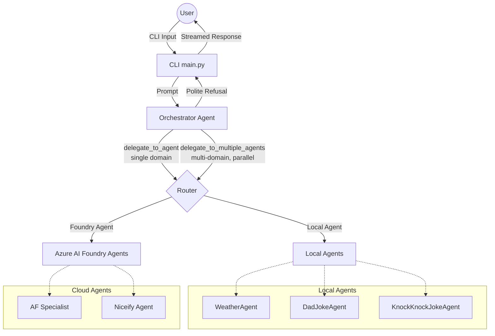

# Foundry Agent Orchestrator

This project implements a multi-agent orchestrator using the `agent_framework` and Azure AI Foundry. It provides a command-line interface (CLI) to interact with a central orchestrator agent that intelligently routes user requests to various specialist agents, which can be either running locally or hosted in the cloud (Azure AI Foundry).

## Architecture

The system is built around a central **Orchestrator Agent** that acts as a router. When a user submits a prompt, the orchestrator analyzes the request and decides whether to answer it directly or delegate it to one of the specialized agents.

### Key Innovation: Pure-Text / No-Code Agents
A major architectural innovation of this project is the **Pure-Text Agent Configuration**. 
* **The Orchestrator is Pure Text:** The complex routing logic, intent classification, and behavioral constraints are not written in Python `if/else` statements. They are defined entirely in natural language within `agents.yaml`.
* **Pure-Text Specialist Agents:** You can create entirely new, fully functional agents (like the `DadJokeAgent` or `KnockKnockJokeAgent`) without writing a single line of code. If an agent's job is purely generative or conversational, it can exist entirely as a YAML configuration block. This allows non-developers to rapidly prototype and deploy new agents.



### Components

1.  **Orchestrator (`orchestrator.py`)**:
    *   Uses the `agent_framework` to create an `OrchestratorDirectAgent`.
    *   Equipped with **two routing tools**:
        *   `delegate_to_agent(agent_name, query)` — routes a single-domain request to one specialist.
        *   `delegate_to_multiple_agents(agent_queries)` — fans out to multiple specialists **concurrently** via `asyncio.gather`. The tool accepts a list of `{agent_name, query}` objects, runs them all in parallel, and returns labeled results for the orchestrator to synthesise. If one agent fails, the others still succeed (`return_exceptions=True`).
    *   Both tools share a common `_invoke_agent` coroutine that handles local-vs-Foundry dispatch, keeping the logic in one place.
    *   **Strict Routing Policy**: The orchestrator is explicitly instructed *not* to answer questions using its own general knowledge. If a request cannot be handled by one of its known specialist agents, it will politely decline to assist.
    *   Dynamically loads local agents from `agents.yaml` and injects the agent list into the orchestrator's prompt automatically via `{{AGENT_LIST}}`.
    *   Supports multiple LLM providers (Azure AI Foundry, Azure OpenAI, OpenAI) configured via environment variables.

2.  **Specialist Agents**:
    *   **Local Agents** (Defined in `agents.yaml`):
        *   `WeatherAgent`: A local agent equipped with a `get_weather` tool (defined in `local_agent.py`) to answer weather-related questions.
        *   `DadJokeAgent`: A local agent that generates dad jokes directly based on its system instructions.
        *   `KnockKnockJokeAgent`: A local agent that generates knock-knock jokes directly based on its system instructions.
    *   **Cloud-Hosted Foundry Agents** (Invoked via `foundry_tools.py`):
        *   `AF`: An Air Force aircraft specialist agent hosted on Azure AI Foundry.
        *   `Niceify`: An agent hosted on Azure AI Foundry that transforms negative or sad content into a positive reframing.

3.  **Foundry Tools (`foundry_tools.py`)**:
    *   Provides async wrappers to invoke existing Azure AI Foundry agents using the `azure-ai-agents` SDK.
    *   Handles authentication, agent ID resolution (with caching), thread creation, and message retrieval.

4.  **CLI (`main.py`)**:
    *   Provides an interactive REPL for users to chat with the orchestrator.
    *   Supports streaming responses.
    *   Includes slash commands for direct agent invocation and session management:
        *   `/af <question>`: Force call the AF specialist agent.
        *   `/niceify <text>`: Force call the Niceify agent.
        *   `/history`: Print conversation history.
        *   `/clear`: Clear conversation history.
        *   `/help`: Show help text.
        *   `/quit` or `/exit`: Exit the CLI.

## Configuration

The system relies on environment variables for configuration. Create a `.env` file in the root directory with the following variables:

```env
# Model Provider (foundry, azure_openai, openai)
MODEL_PROVIDER=foundry

# Azure AI Foundry Configuration
FOUNDRY_PROJECT_ENDPOINT=<your_project_endpoint>
FOUNDRY_MODEL_DEPLOYMENT_NAME=<your_model_deployment_name>
# Optional: Set to "true" to use API key auth instead of DefaultAzureCredential
FOUNDRY_USE_KEY_AUTH=false
FOUNDRY_API_KEY=<your_api_key>

# Foundry Agent Names (if different from defaults)
AF_AGENT_NAME=AF
NICEIFY_AGENT_NAME=Niceify

# Azure OpenAI Configuration (if MODEL_PROVIDER=azure_openai)
AZURE_OPENAI_ENDPOINT=<your_azure_openai_endpoint>
AZURE_OPENAI_DEPLOYMENT_NAME=<your_deployment_name>
AZURE_OPENAI_API_KEY=<your_api_key>

# OpenAI Configuration (if MODEL_PROVIDER=openai)
OPENAI_MODEL=<your_openai_model>
OPENAI_API_KEY=<your_api_key>
```

## Usage

1.  Ensure you have the required dependencies installed (see `requirements.txt` or `pyproject.toml`).
2.  Set up your `.env` file with the necessary credentials and endpoints.
3.  Run the CLI:

```bash
python main.py
```

To enable debug logging, run:

```bash
python main.py --debug
```

## Parallel Delegation

The orchestrator transparently chooses between single-agent and multi-agent routing based on the user's prompt alone. **No special syntax is required from the user.**

### How it works

The orchestrator's system prompt contains explicit routing rules:

- **Single domain** → calls `delegate_to_agent` once.
- **Multiple domains** → calls `delegate_to_multiple_agents` with all relevant agents in one shot, fans them out concurrently, then synthesises a single answer.

### Example prompts

| Prompt | Routing | Agents called |
|---|---|---|
| `Tell me a dad joke.` | single | `DadJokeAgent` |
| `What's the weather in Chicago?` | single | `WeatherAgent` |
| `Tell me a dad joke AND a knock-knock joke.` | **parallel** | `DadJokeAgent`, `KnockKnockJokeAgent` |
| `What's the weather in Seattle? Also give me a dad joke about rain.` | **parallel** | `WeatherAgent`, `DadJokeAgent` |
| `Give me a knock-knock joke, a dad joke, and the weather in NYC.` | **parallel** | `KnockKnockJokeAgent`, `DadJokeAgent`, `WeatherAgent` |
| `Tell me about the F-22 and then make the description nicer.` | sequential\* | `AF` → `Niceify` |

> \* Sequential chaining (pipeline) where the output of one agent feeds into the next is a separate planned feature (Task #4). The orchestrator currently handles this by calling agents one at a time in separate turns.

### Performance benefit

For a 3-agent parallel request, wall time is roughly equal to the **slowest** single agent call rather than the sum of all three. For agents with even modest latency (e.g., 1–2 s each), this is a 2–3× improvement in response time.

## Adding New Agents

### Adding a Local Agent
1.  Define the agent's instructions and tools in `agents.yaml`.
2.  Implement any necessary tools in a Python module (e.g., `local_agent.py`).
3.  Update the `OrchestratorDirectAgent` instructions in `agents.yaml` to make it aware of the new agent.

### Adding a Foundry Agent
1.  Ensure the agent is deployed in your Azure AI Foundry project.
2.  Update the `OrchestratorDirectAgent` instructions in `agents.yaml` to make it aware of the new agent.
3.  The `delegate_to_agent` tool in `orchestrator.py` will automatically attempt to resolve and call the Foundry agent by its display name if it's not found locally.

## Recent Updates
*   **Parallel Delegation**: The orchestrator now supports `delegate_to_multiple_agents`, which fans out to N specialist agents concurrently using `asyncio.gather`. Multi-domain prompts are automatically detected and routed in parallel — no user-side changes needed.
*   **Shared Dispatch Core**: Both delegation tools delegate to a single `_invoke_agent` coroutine, keeping local-vs-Foundry routing logic in one place and eliminating duplication.
*   **Streaming Responses**: The orchestrator streams responses back to the CLI in real-time, significantly reducing perceived latency and improving the user experience.
*   **Dynamic Agent Loading with Auto-Injection**: Local agents are dynamically loaded from `agents.yaml`. The agent list is injected into the orchestrator's system prompt automatically via `{{AGENT_LIST}}` — adding a new agent to the YAML is all that's needed.
*   **Unified Routing**: `delegate_to_agent` handles routing to both local and cloud-hosted Foundry agents seamlessly.
